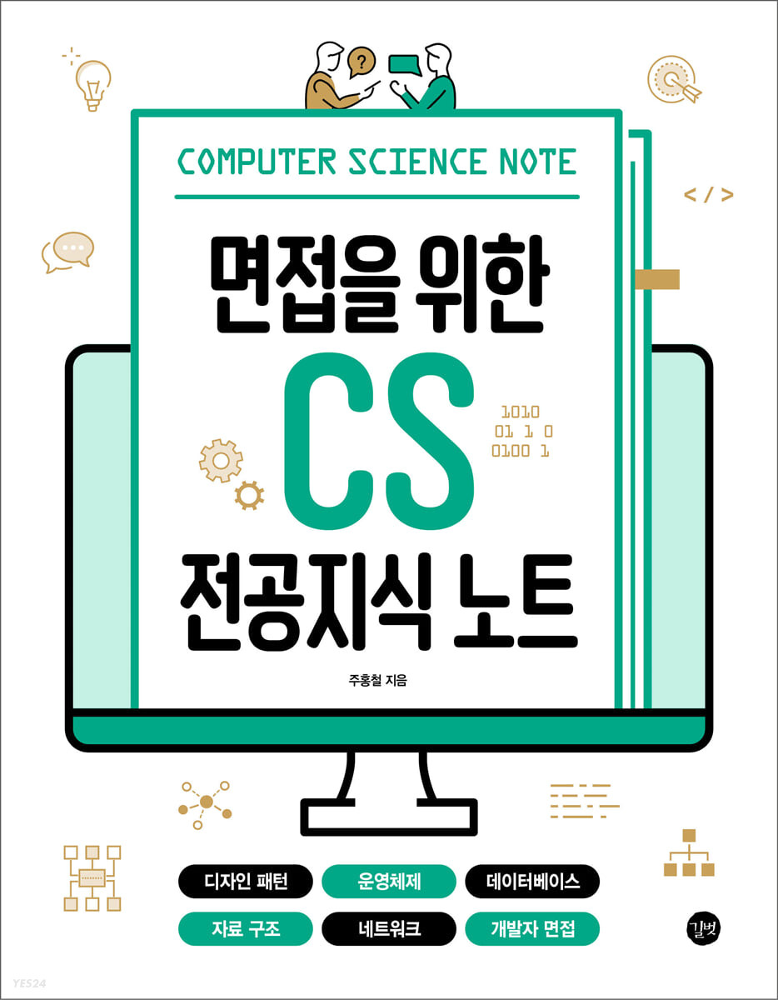

# 면접을 위한 cs 전공지식 노트

# Chapter 5. 자료구조

## Section 1.복잡도

### 시간 복잡도

> 시간복잡도는 '문제를 해결하는 데 걸리는 `시간과 입력의 함수 관계`'를 말합니다.

속도 비교

- O(n^2) < O(n) < O(logN) < O(1)

### 공간 복잡도

> 공간 복잡도는 프로그램을 실행시켰을 때 필요로 하는 `자원 공간의 양`을 말합니다.

### 자료 구조에서의 시간 복잡도

자료 구조의 `평균` 시간 복잡도

| 자료구조         | 접근    | 탐색    | 삽입    | 삭제    |
| ---------------- | ------- | ------- | ------- | ------- |
| 배열             | O(1)    | O(n)    | O(n)    | O(n)    |
| 스택             | O(n)    | O(n)    | O(1)    | O(1)    |
| 큐               | O(n)    | O(n)    | O(1)    | O(1)    |
| 이중 연결 리스트 | O(n)    | O(n)    | O(1)    | O(1)    |
| 해시 테이블      | O(1)    | O(1)    | O(1)    | O(1)    |
| 이진 탐색 트리   | O(logn) | O(logn) | O(logn) | O(logn) |
| AVL 트리         | O(logn) | O(logn) | O(logn) | O(logn) |
| 레드 블랙 트리   | O(logn) | O(logn) | O(logn) | O(logn) |

자료 구조의 `최악의` 시간 복잡도

| 자료구조         | 접근    | 탐색    | 삽입    | 삭제    |
| ---------------- | ------- | ------- | ------- | ------- |
| 배열             | O(1)    | O(n)    | O(n)    | O(n)    |
| 스택             | O(n)    | O(n)    | O(1)    | O(1)    |
| 큐               | O(n)    | O(n)    | O(1)    | O(1)    |
| 이중 연결 리스트 | O(n)    | O(n)    | O(1)    | O(1)    |
| 해시 테이블      | O(n)    | O(n)    | O(n)    | O(n)    |
| 이진 탐색 트리   | O(n)    | O(n)    | O(n)    | O(n)    |
| AVL 트리         | O(logn) | O(logn) | O(logn) | O(logn) |
| 레드 블랙 트리   | O(logn) | O(logn) | O(logn) | O(logn) |

## Section 2.선형 자료 구조

- 선형 자료 구조란 요소가 `일렬로 나열 되어 있는 자료구조`를 말합니다.

### 연결 리스트

> 연결 리스트는 데이터를 감싼 노드를 포인터로 연결해서 공간적인 효율성을 극대화 시킨 자료 구조입니다.
> 삽입과 삭제가 O(1)이 걸리며 탐색에는 O(n)이 걸립니다.

- 싱글 연결 리스트: next 포인터만 가집니다.
- 이중 연결 리스트: next 포인터와 prev 포인터를 가집니다.
- 원형 이중 연결 리스트: 이중 연결 리스트와 같지만 마지막 노드의 next 포인터가 헤드 노드를 가리키는 것을 말합니다.
