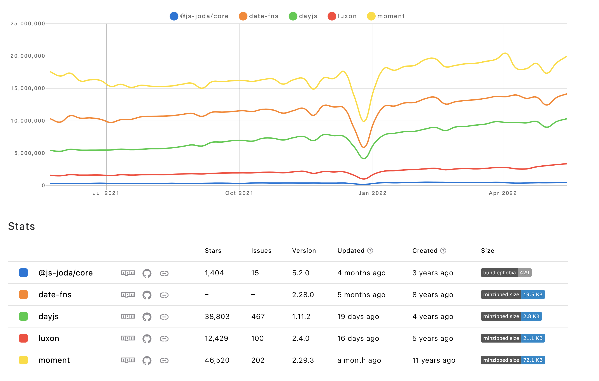

# Typescript에서 Date 객체 사용하기

## dayjs

## js-joda

## dayjs vs js-joda

---

### References

- [dayjs](https://day.js.org/)
- [js-joda](https://github.com/js-joda/js-joda)
- [향로님의 블로그(jojoldu.tistory.com)](https://jojoldu.tistory.com/600?category=635878)
